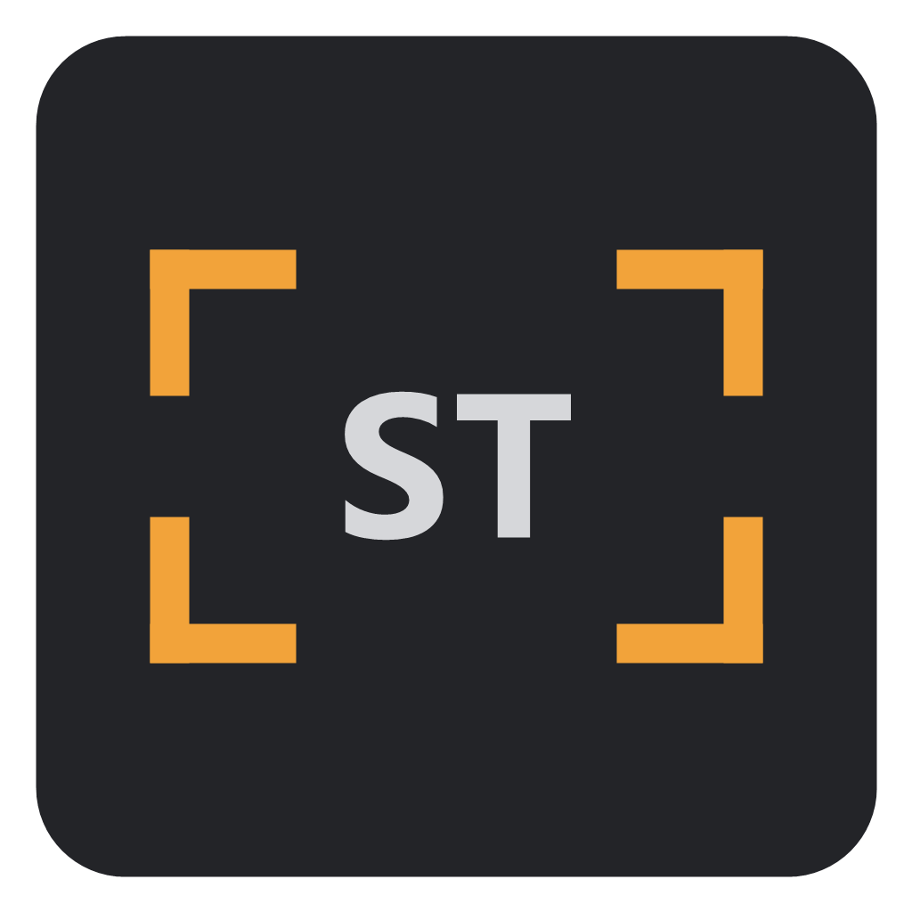

  

<h1 align="center">Second Team</h1>

  Film previs on your own machine: block the set, frame up for real sensors and lenses, and export storyboards in one click. 
  Windows · Mac (Apple Silicon) · by Distraction Digital

---

Second Team is a desktop previsualisation app for filmmakers. You greybox a set, pose people in it, light it, and place cameras with real sensors and focal lengths. Every shot is framed exactly as your camera package would see it, and the whole sequence becomes a storyboard you can hand to a client or crew in one click.

When you want more than clay, Second Team can bring your boards to life with AI frames generated from your own sets, cameras and characters. It all happens on your own computer: the AI runs on your graphics card, not in a datacenter. Your scripts, sets, reference photos and frames never leave your machine. There are no accounts, no subscriptions and no per-image fees.

## Features

- **Set building:** boxes, cylinders, planes and other primitives, groups, and snapping to the grid or to surfaces. It uses Blender-style navigation and works with a mouse or a trackpad.
- **People:** realistic human figures (built on MakeHuman) with body sliders, skin tone, eyes, expressions, hands, hair and clothing, or classic art mannequins.
  - Pose them joint by joint, or by dragging hands, feet and hips.
  - Plant hands and feet on surfaces, and aim heads with Look at.
  - Use pose presets and a pose library.
- **Cameras:** 45+ real camera bodies and recording formats (ARRI, RED, Sony, Canon, Blackmagic, Nikon, plus Super 16, Super 35 and Full Frame), anamorphic squeeze, focal length, stop and focus, frame guides, and the delivery frame. Clay pictures have optically accurate depth of field, with click-to-focus. A camera HUD shows height, tilt, distance, shot size and angle.
- **Scenes and shots:** each scene has its own set, and each shot can cheat anything (placement, pose, lighting) without touching the others. Shots are slated automatically (1A, 1B, 1C…).
- **Lighting:** sun, point, spot and ambient lights with intensity in stops, colour temperature and real source sizes. Clay shading previews the light with soft shadows that harden at contact, ambient occlusion and bounce light from the ground; time of day and atmosphere set the sky.
- **Storyboard:** every shot in the board order you choose, with descriptions, dialogue and notes, shown as its lit clay render (or its chosen AI frame). Export to PDF (grid or rows, Letter or A4) or numbered PNGs.

## AI frames: bring your boards to life

Turn any shot into a finished-looking frame, in the style you choose: photoreal film still, pencil sketch, painted concept art.

- **Optional.** Skip the AI setup and everything else works without it. Every AI control folds away.
- **Guided by your set, not guesswork.** Each frame follows your blocking's depth, your figures' poses and your camera's exact framing and lens. What you staged is what you get.
- **Continuity.** Give cast members and props a description and reference photos, and they look the same from shot to shot. A project style and style references keep the whole board consistent.
- **Entirely local.** The AI engine ([ComfyUI](https://github.com/Comfy-Org/ComfyUI)) is installed and run by the app on your own NVIDIA graphics card. Nothing is uploaded and nothing is generated in a datacenter: your projects, reference photos and frames stay on your computer. The only internet use is the one-time download of the engine and models, from pinned sources with verified checksums, and a check for new versions of Second Team on GitHub (which can be turned off).
- **Safe for paid work.** Every model it uses allows commercial use of its output, and each take records the model and licence it was made with.

## Download

Installers are on the [Releases](https://github.com/distractiondigital/SecondTeam/releases) page.

| | Installer | Notes |
|---|---|---|
| **Windows 10/11** | `Second.Team.Setup.<version>.exe` | Not code-signed yet: on "Windows protected your PC", click **More info → Run anyway**. |
| **Mac (Apple Silicon)** | `Second.Team.<version>.Apple.Silicon.dmg` | Not notarized yet: the first time, **System Settings → Privacy & Security → Open Anyway**. See [docs/MAC.md](docs/MAC.md). |

**System requirements for AI frames:** Windows with an NVIDIA graphics card (driver 580 or newer; 8 GB+ video memory recommended) and about 20 GB of disk space. The first start offers to download the AI engine and models; you can skip it, and everything else works without them. AI on Mac is coming soon.

## Documentation

- [User guide](docs/GUIDE.md): every control, tool and workflow
- [Mac guide](docs/MAC.md): installing on a Mac, and the Mac controls
- [Development](docs/DEVELOPMENT.md): running from source, building installers
- [Specification](docs/SPEC.md) and [progress](docs/PROGRESS.md)

## Credits

Second Team builds on open work, most of all [MakeHuman](https://static.makehumancommunity.org/) (human figures, CC0), [ComfyUI](https://github.com/Comfy-Org/ComfyUI) (the AI engine), [Electron](https://www.electronjs.org), [React](https://react.dev) and [three.js](https://threejs.org). Some clothing is CC-BY by MakeHuman community artists Elvaerwyn, EWS, Mindfront, punkduck and janexx.

The full list, with licences, is in [CREDITS.md](CREDITS.md) and under **Credits** on the app's start screen. Every AI model the app downloads allows commercial use of its output; each one's licence is recorded in [backend/manifest.json](backend/manifest.json).

Second Team was designed by a filmmaker, not a software developer. It was realized with AI as a tool to assist filmmakers to create, communicate and collaborate on their art, and that's why it will always be open and free.

## Licence

© 2026 Distraction Digital. Second Team is free and open source software under the [GNU General Public License v3.0](LICENSE).
